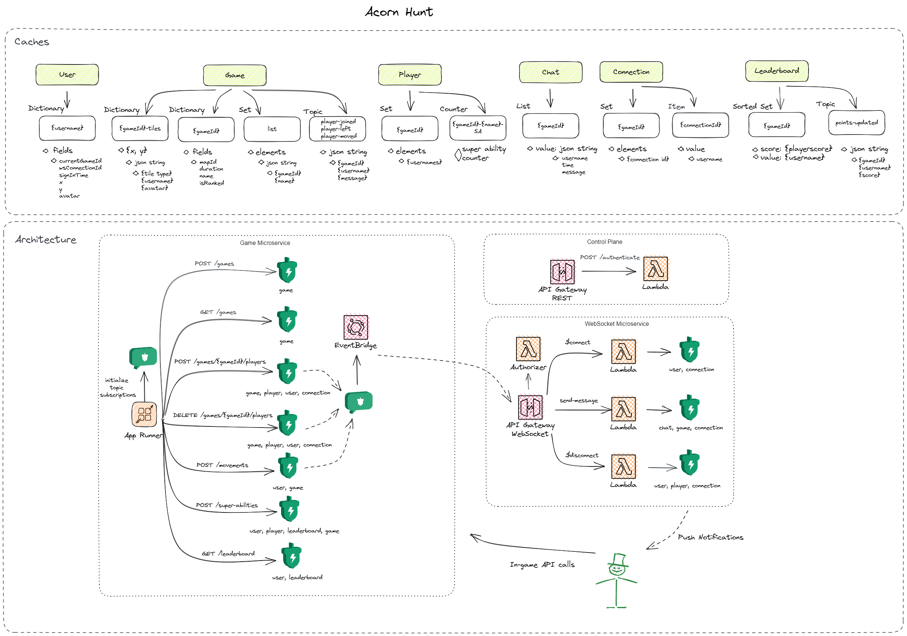

# Acorn Hunt: Game Microservice

This microservice is responsible for tracking player activity in a game of Acorn Hunt. It uses Momento Cache and Topics to keep track of scores, movements, and super-ability uses.

## Dev environment

The development environment url is: `https://pmizqmbanw.us-east-1.awsapprunner.com`. There currently is no production environment

## Architecture

This service uses [AWS App Runner](https://aws.amazon.com/apprunner/) to manage a containerized web service in a serverless manner. The App Runner service powering this API is defined as Infrastructure as Code (IaC) in the [Acorn Hunt repository](https://github.com/momentohq/acorn-hunt).

## Endpoints

This microservice contains the following endpoints:

* `POST /games`
* `GET /games`
* `POST /games/{gameId}/players`
* `DELETE /games/{gameId}/players`
* `POST /points`
* `POST /super-abilities`
* `DELETE /super-abilities`
* `POST /movements`
* `GET /leaderboards`

For full API details, please [refer to the specification](./openapi.yaml).

## Supporting repositories

There are two other repositories that make up *Acorn Hunt*:

* [WebSocket Microservice](https://github.com/momentohq/acorn-hunt)
* [User Interface](https://github.com/momentohq/acorn-hunt-ui)

## Demo

Interested in seeing a demo of this repository in action? Check out the [Momento YouTube page](https://www.youtube.com/@gomomento)!